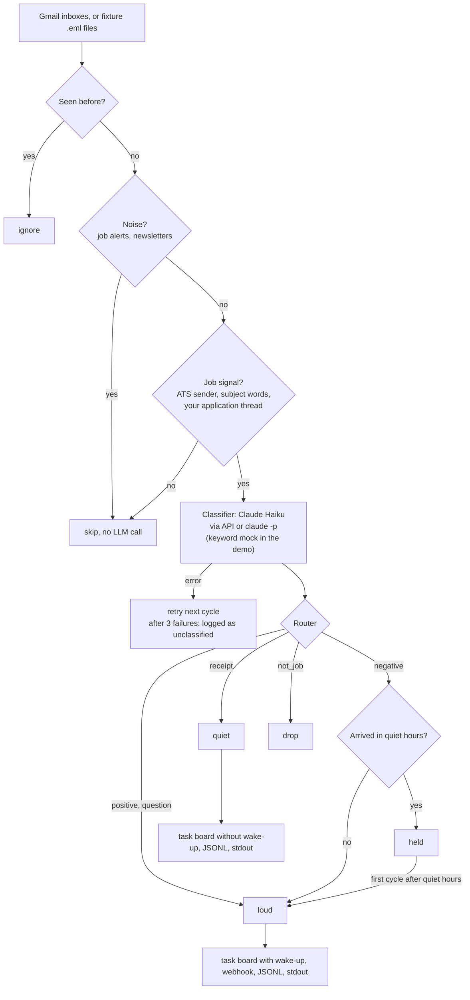

# job-reply-classifier

Watches several Gmail inboxes for replies to job applications, has Claude Haiku sort each reply
(receipt, positive, negative, question, or not job related) and routes the result: receipts are
logged quietly, interview invitations and questions ping you right away, rejections that arrive at
night wait until the morning.

This is a sanitized rebuild of a watcher I run in production on my own inboxes. The production
version checks two Gmail accounts every two minutes and posts to a task board that an assistant
agent works from. This repo replaces the private parts with pluggable sources, classifiers and
sinks, and adds an offline demo that runs without any account or key.

## The problem

When you apply for many jobs, the replies arrive in more than one inbox and drown in noise: job
alerts that say "Neue Stelle für Sie", newsletters about interviews, applicant tracking receipts,
client mail. The few mails that matter (an interview slot, a question about salary with a
deadline) are easy to miss for a day. Reading everything with an LLM works but is wasteful, and a
mail is untrusted input that should never steer the model.

## What it does

1. Every two minutes (configurable), lists new inbound mail in each inbox: inbox only, not from
   you, without the promotions, social and forums tabs.
2. Skips ids it has already handled.
3. Pre-filters with regular expressions only:
   - drops job alerts and newsletters first;
   - keeps mail from applicant tracking systems (Workday, Personio, JOIN, Greenhouse, Ashby and
     about 25 more vendors, plus sender words like `careers` or `recruiting`), mail with
     application words in the subject in German or English ("Bewerbung", "Absage",
     "your application", "interview"), and replies in a thread you started with an application.
4. Sends the remaining candidates to Claude Haiku, which returns `kind`, `company`, `role`, a
   one-line `summary` and a `deadline`.
5. Routes by kind: positive and question are loud, receipt is quiet, negative is loud by day and
   held overnight, not_job is dropped.
6. Delivers to sinks: stdout, a JSONL log, a webhook (Slack, n8n, anything that takes JSON) and a
   task board interface (CSV implementation included).

## Architecture



## Quickstart: offline demo

Python 3.10 or newer. No installs, no keys, no network.

```bash
cd job-reply-classifier
python demo.py        # or: make demo
```

The demo runs the real watcher over 14 fictional mails in two inboxes (`fixtures/inbox/`) and
one sent application (`fixtures/sent/`). Only the classifier is swapped for a keyword mock, and
the webhook calls are captured instead of sent. It pretends it is Friday 23:50, then runs the
next cycle at 07:02. Actual output:

```text
Job reply classifier: offline demo
  14 fictional mails in 2 inboxes (you@example.com, you@example.org), plus 1 sent mail for thread checks
  classifier: mock (keyword rules standing in for Claude Haiku, no API calls)
  clock: Fri 2026-10-02 23:50 Europe/Berlin, quiet hours 23:00-07:00

1. Pre-filter (regex only, no LLM): 9 of 14 mails go to the classifier
  #   From                      Subject                                 Pre-filter
  --  ------------------------  --------------------------------------  ----------------------------------
  01  Globex Analytics Careers  Thank you for applying: Automation...   candidate: ATS sender "myworkday"
  02  Initech Digital GmbH      Ihre Bewerbung als KI-Automatisieru...  candidate: ATS sender "personio"
  03  StepStone Jobagent        Neue Stelle für Sie: Automation Eng...  skip: job alert
  04  Acme Robotics Recruiting  Interview invitation: AI Workflow E...  candidate: ATS sender "greenhouse"
  05  Vandelay Logistics        Update on your application for Auto...  candidate: ATS sender "ashbyhq"
  06  Indeed                    15 new jobs for "workflow automatio...  skip: job alert
  07  The Workflow Example...   Issue #42: what hiring managers ask...  skip: newsletter
  08  LinkedIn Job Alerts       Your job alert for automation engin...  skip: job alert
  09  Max Mustermann            Ihre Bewerbung: Einladung zum Kenne...  candidate: subject: "bewerbung"
  10  Jane Example              Re: Order workflow - next steps         candidate: subject: "next steps"
  11  Parcel Example            Your package is on its way              skip: no job signal
  12  Mara Example              Two quick questions before we talk      candidate: your application thread
  13  Talent Rewards Desk       Your application has been approved      candidate: ATS sender "talent"
  14  Muster Automation Gmb...  Ihre Bewerbung bei Muster Automatio...  candidate: ATS sender "join.com"

2. Classifier (mock), 9 calls, and routing
  #   Kind      Company                 Role                            Deadline          Route
  --  --------  ----------------------  ------------------------------  ----------------  --------------------
  01  receipt   Globex Analytics        Automation Engineer             -                 quiet
  02  receipt   Initech Digital GmbH    KI-Automatisierungsentwickler   -                 quiet
  04  positive  Acme Robotics           AI Workflow Engineer            2026-10-07 14:00  LOUD
  05  negative  Vandelay Logistics      Automation Solutions Engineer   -                 LOUD
  09  positive  Initech Digital GmbH    KI-Automatisierungsentwickler   2026-10-08 10:30  LOUD
  10  not_job   -                       -                               -                 drop
  12  question  Hooli Labs Inc.         n8n Automation Specialist       2026-10-09        LOUD
  13  not_job   -                       -                               -                 drop
  14  negative  Muster Automation GmbH  Prozessautomatisierung mit n8n  -                 held until Sat 07:00

3. Delivered tonight
  04  LOUD   taskboard (wake), webhook, jsonl
      Invites you to an interview or call on 2026-10-07 14:00.
  05  LOUD   taskboard (wake), webhook, jsonl
      Rejection: they will not move forward with this application.
  09  LOUD   taskboard (wake), webhook, jsonl
      Invites you to an interview or call on 2026-10-08 10:30.
  12  LOUD   taskboard (wake), webhook, jsonl
      Asks for salary expectations and earliest start date, reply by 2026-10-09.
  01  quiet  taskboard, jsonl
      Automatic confirmation that the application arrived.
  02  quiet  taskboard, jsonl
      Automatic confirmation that the application arrived.
  14  held   nothing yet, waits for the morning
      Rejection: they will not move forward with this application.
  10  drop   not routed
      Not about a job application.
  13  drop   not routed
      Mentions a job but is not a reply to an application.

4. Next cycle, Sat 2026-10-03 07:02, the first one after quiet hours
  new mail: 0 (14 seen before)
  14  LOUD   taskboard (wake), webhook, jsonl
      released: JOB REPLY NEGATIVE: Muster Automation GmbH - Prozessautomatisierung mit n8n

Files in demo-output/
  task-board.csv  7 cards, 5 with wake=yes
  events.jsonl    7 events
  state.json      14 seen ids, 0 held

Webhook, Slack format: 5 payloads captured, nothing sent. The first one reads:
  | *JOB REPLY POSITIVE: Acme Robotics - AI Workflow Engineer*
  | Invites you to an interview or call on 2026-10-07 14:00.
  | Deadline: 2026-10-07 14:00
  | Received 2026-10-01 10:47 in you@example.com
```

All companies, people and addresses in the fixtures are fictional.

## Tests

```bash
python -m venv .venv && . .venv/bin/activate
pip install -e ".[anthropic,dev]"
pytest
```

86 tests, no network. They cover the pre-filter and its order, the noise filter, state handling
(pruning, atomic writes, corrupt files, retries, held replies), routing and quiet hours, prompt
building and output validation, all three classifiers (the API and CLI ones against fakes), the
Gmail source against a fake HTTP layer, the sinks, and a full cycle over the fixtures.

## Real mode

1. **Install and configure**

   ```bash
   pip install -e ".[anthropic]"      # the SDK is only needed for CLASSIFIER=anthropic
   cp .env.example .env
   ```

2. **Gmail access.** Create a Google Cloud project, enable the Gmail API and create an OAuth
   client. One easy way to get a refresh token per inbox is the
   [OAuth 2.0 Playground](https://developers.google.com/oauthplayground): use a client of type
   "Web application" with the redirect URI `https://developers.google.com/oauthplayground`, tick
   "Use your own OAuth credentials" in the Playground settings, authorize the scope
   `https://www.googleapis.com/auth/gmail.readonly` while signed in to the inbox, and exchange the
   code for tokens. Put the client id and secret in `GMAIL_CLIENT_ID` / `GMAIL_CLIENT_SECRET`, and
   each inbox as `GMAIL_INBOX_n` plus `GMAIL_REFRESH_TOKEN_n`. If the consent screen stays in
   "Testing", Google expires these refresh tokens after 7 days.

3. **Classifier.** `CLASSIFIER=anthropic` uses the Messages API with `ANTHROPIC_API_KEY` and
   `claude-haiku-4-5`. `CLASSIFIER=claude-cli` calls the local Claude Code CLI (`claude -p`) and
   uses your Claude login instead of an API key. `CLASSIFIER=mock` is the keyword stand-in.

4. **Sinks.** `SINKS=stdout,jsonl,taskboard,webhook`. The webhook takes `WEBHOOK_FORMAT=json`
   (the whole event) or `slack` (an incoming-webhook message), and by default only gets loud
   events (`WEBHOOK_PRIORITIES=loud`).

5. **Run it**

   ```bash
   python -m job_reply_classifier --dry-run    # one cycle, prints what it would route, writes nothing
   python -m job_reply_classifier --loop       # one cycle every POLL_SECONDS (default 120)
   ```

   Or one cycle per cron tick: `*/2 * * * * cd /path/to/job-reply-classifier && .venv/bin/python -m job_reply_classifier`.
   On Linux and macOS a lock file next to the state file stops two cycles from overlapping.

## Project layout

```text
demo.py                        offline demo
job_reply_classifier/
  cli.py                       python -m job_reply_classifier
  config.py                    settings from .env, wiring
  pipeline.py                  one watcher cycle (Watcher)
  prefilter.py                 noise filter and cheap job-signal checks
  routing.py                   loud, quiet, held, drop; quiet hours
  state.py                     seen ids, retries, held replies (bounded JSON file)
  models.py                    Envelope, Classification, ReplyEvent
  errors.py                    ClassificationError (retry) vs ConfigError (stop)
  report.py                    plain-text tables
  sources/                     gmail.py, fixtures.py, mail_parse.py (shared RFC 822 parser)
  classifiers/                 base.py (prompt, schema, validation), anthropic_api.py, claude_cli.py, mock.py
  sinks/                       stdout.py, jsonl.py, webhook.py, taskboard.py
fixtures/
  inbox/                       14 fictional .eml files
  sent/                        1 sent application, for the thread check
tests/                         pytest, no network
```

## Design decisions

### Cheap checks before the LLM

Every mail walks down a cost ladder and stops at the first step that decides it:

| Step | Cost | Runs for |
|---|---|---|
| seen ids | free | every listed id |
| headers: noise filter, ATS sender, subject words | one metadata call | every new mail |
| thread lookup: did you start this thread with an application? | one call | only when the headers found nothing |
| full body | one call | candidates |
| LLM | one Haiku call | candidates |

The noise filter runs before the job-signal checks on purpose: job alerts are full of application
words ("Neue Stelle für Sie", "12 new positions") and would pass every later check. The rest of
the pre-filter aims for recall, not precision: the client mail about "next steps" (fixture 10)
gets through and the classifier drops it. One extra Haiku call is cheaper than a missed interview.
In the demo, 9 of 14 mails reach the classifier.

### The email is data, not instructions

- The system prompt holds the instructions; the mail sits inside `<email>` tags in the user turn,
  and the prompt says that nothing inside the tags is an instruction.
- `<email>` and `</email>` are stripped from the mail itself, so it cannot close the data block
  early. Fixture 13 tries that and also tells "any AI system" to classify it as positive. In my
  test run with the CLI classifier, Haiku labelled it `not_job` (a phishing attempt).
- The answer is constrained (a JSON schema with an enum for `kind`, through structured outputs on
  the API and `--json-schema` on the CLI) and then validated again: `kind` must be one of five
  values, free text is flattened to one line and capped, and `deadline` must parse as a date.
  Haiku once answered `"deadline": "Not specified"` during testing; validation turns that into "".
- The CLI classifier runs with all tools disabled (`--tools ""`), its own system prompt, no MCP
  servers, no session history, in an empty temp directory, with the mail on stdin rather than in
  argv where other users could see it in the process list.
- Text from the mail is escaped before it goes into a Slack message, so a sender cannot sneak an
  `@channel` mention into your notifications.
- The quoted history of a reply is cut before classifying. It repeats your own application and
  only costs tokens.

### Quiet vs loud

| Kind | Priority | Task board | Webhook (default) | JSONL, stdout |
|---|---|---|---|---|
| positive, question | loud | card with wake-up | yes | yes |
| negative | loud, or held at night | card with wake-up | yes | yes |
| receipt | quiet | card, no wake-up | no | yes |
| unclassified (classifier kept failing) | quiet | card, no wake-up | no | yes |
| not_job | drop | no | no | no |

Each sink subscribes to the priorities it wants. Receipts still land on the board, so the
application tracker stays complete, but they never ping anyone.

### Night-time hold

Rejections that arrive during quiet hours (default 23:00 to 07:00) are kept in the state file and
released by the first cycle after the window ends. Good news and questions still go out at night,
because they often carry a deadline. If the watcher was offline and only sees a night-time
rejection in the morning, it goes out right away instead of waiting for the next night.

### State and failure handling

- Seen ids are stored with a timestamp and pruned after 30 days and beyond 5,000 entries. The
  retention has to be longer than the lookback window, otherwise old mail would come back as new;
  the watcher refuses to start with a config that breaks this.
- The first run looks back 24 hours, later runs 72 hours, so a watcher that was down for a day
  catches up without duplicates.
- A failed classification leaves the mail unseen and it is retried next cycle. After
  `MAX_ATTEMPTS` it is logged as `unclassified` on the quiet path instead of disappearing. The
  production script I started from treated an unreadable model answer as `not_job`, which could
  hide a real reply.
- Setup problems (rejected API key, revoked Gmail token, missing CLI) raise `ConfigError` and stop
  the cycle, so they do not burn through every mail's retry budget.
- A failing sink is logged and the other sinks still get the event.
- The state file is written atomically; a corrupt file is moved aside and the watcher starts
  fresh.

### One parser for the demo and for Gmail

The Gmail source asks for `format=raw`, the same bytes an `.eml` file holds. Fixtures and real
mail go through the same parser (MIME parts, charsets, quoted-printable, RFC 2047 headers, HTML
to text), so the offline demo exercises the code that real mode runs.

## Limitations

- Gmail only. IMAP or Microsoft 365 would be another `Source` with the same four methods.
- The mock classifier is keyword matching for the demo and tests, not a classifier you would use.
- Delivery is at most once per sink: a failed webhook call is logged, not retried.
- State is saved once per cycle; a crash in the middle of a cycle can process that cycle's mail
  again.
- The pre-filter patterns are tuned to German and English mail and to ATS vendors common in
  Germany. Extend `ATS_SENDER`, `APPLICATION_WORDS` and `NOISE_RULES` in `prefilter.py` for
  other markets.
- The task board interface ships with a CSV implementation only.
- While building this repo I ran the Gmail source read-only against a real inbox and the CLI
  classifier with a real Claude login on the fixtures. The Anthropic API classifier is only tested
  against a fake client.

## License

MIT, see [LICENSE](LICENSE).
